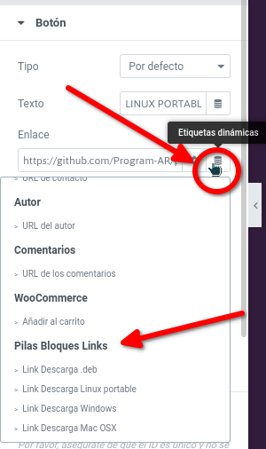
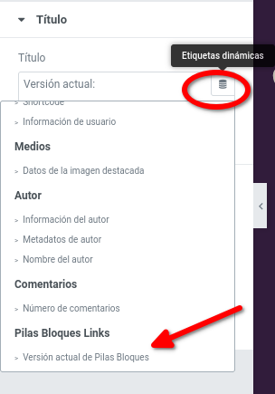

¡Hola! :vulcan_salute: Este es un proyecto relacionado a [Pilas Bloques](https://pilasbloques.program.ar) :heart:. En el repositorio de ese proyecto encontrarás las guías sobre [cómo contribuir](https://github.com/Program-AR/pilas-bloques-app/blob/develop/CONTRIBUTING.md) y el [código de conducta](https://github.com/Program-AR/pilas-bloques-app/blob/develop/CODE_OF_CONDUCT.md), que son guías que aplican también a este proyecto.

Hi! :vulcan_salute: This is a project related to [Pilas Bloques](https://pilasbloques.program.ar) :heart:. In that project's repository you'll find the [contribution guidelines](https://github.com/Program-AR/pilas-bloques-app/blob/develop/CONTRIBUTING_en.md) and the [code of conduct](https://github.com/Program-AR/pilas-bloques-app/blob/develop/CODE_OF_CONDUCT_en.md) which also apply to this project.

# wp-elementor-pblinks
Wordpress Elementor Plugin for getting links to Pilas Bloques installers as dynamic tags

Adds dynamic tags for Pilas Bloques URLs:

Adds dynamic tags for Pilas Bloques Version Text:

